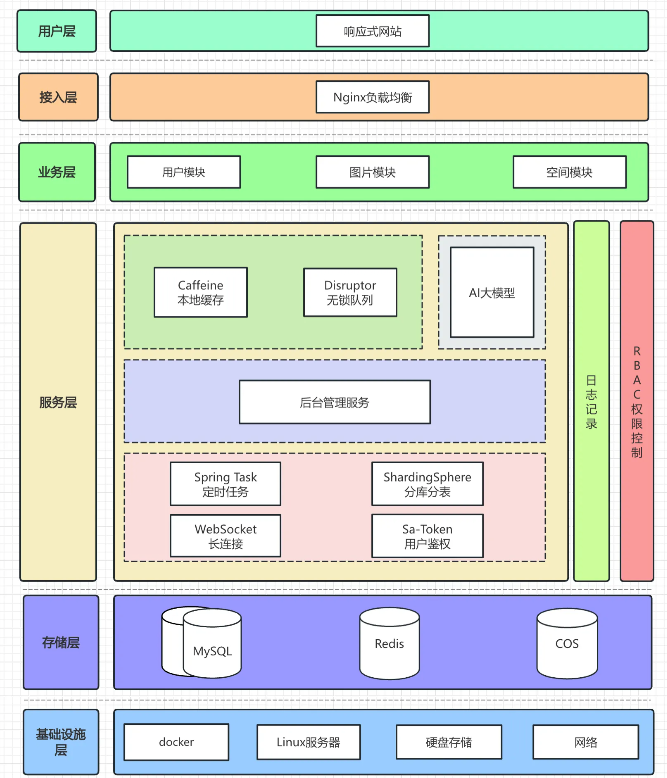

## 架构图

## 技术栈
- Java Spring Boot 框架
- MySQL 数据库 + MyBatis-Plus 框架 + MyBatis X
- Redis 分布式缓存 + Caffeine 本地缓存
- Jsoup 数据抓取
- COS 对象存储
- ShardingSphere 分库分表
- Sa-Token 权限控制
- DDD 领域驱动设计
- WebSocket 双向通信
- Disruptor 高性能无锁队列
- JUC 并发和异步编程
- AI 绘图大模型接入
- 模版方法模式 门面模式
- 多角度项目优化：性能、成本、安全性等